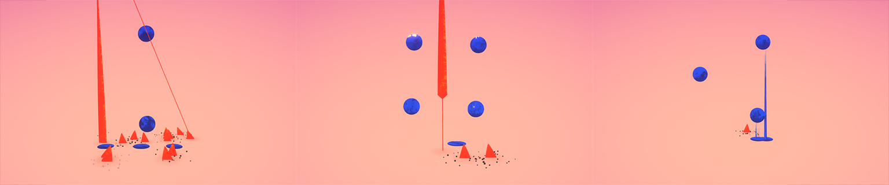

# worldwar
worldwar is my entry for [Mini Jam 56](https://itch.io/jam/mini-jam-56-sky).
The game had to be done within 2 days. The theme was sky; additionally the game had to incorporate the two words "warzone" and "doughnut". See the submission on [itch.io](https://daniellanner.itch.io/worldwar)

## The controls.
Press enter (return) to start and restart the game. Press escape to quit.

Don't get hit by the incoming missiles. The game ends as soon as you've lost five orbs. Rotate your life force by using the left and right arrow keys or the left joystick on your controller. Dilate your life force using the up and down arrow keys or the right joystick on your controller.

For convenience you may invert the controls using the I key or the Y button on your controller.

## The concept.

The words sky and warzone are pretty self explanatory. For doughnut I strayed a little bit out of the box by choosing the shape of a doughnut as the main game element. That counts. Probably. The idea behind the game is one of initial misleading. What looks like shells dropping from the sky turn out to be lovely trees and the life force you are bleeding are actually lakes. 

There's two possible messages to take away, either 

* nature will outlive all of our conflicts, or 
* we're bombing ourselves back into the bronze age.
It's up to you to interpret it however you see fit.
